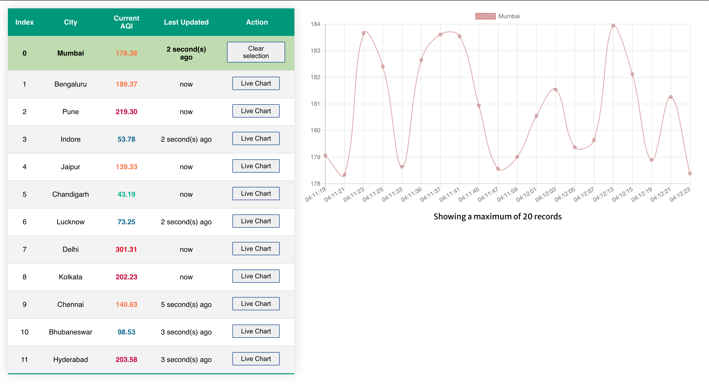

# Live Air Quality Index (AQI)

Air quality index data visualization for different cities

Live page: https://cnp96.github.io/live-aqi/

## Development Duration
### Day 1
- [x] Initialize boilerplate
- [x] Establish socket connection / handle reconnect logic
- [x] Decide data structures to store the live data
- [x] Display data in cards UI

### Day 2
- [x] Restructure the UI with tables instead of cards
- [x] Update the data structure to accommodate "last updated"
- [x] Added chart.js library but live chart is yet to be configured

### Day 3
- [x] Fixed aqi history update using reducer 
- [x] Added live chart for AQI data per city

> It took approximately 14-15 hours to build the project because I ran into some issues with chart.js

## Available Scripts

In the project directory, you can run:

### `yarn start`

Runs the app in the development mode.\
Open [http://localhost:3000](http://localhost:3000) to view it in the browser.

The page will reload if you make edits.\
You will also see any lint errors in the console.

### `yarn build`

Builds the app for production to the `build` folder.\
It correctly bundles React in production mode and optimizes the build for the best performance.

The build is minified and the filenames include the hashes.\
Your app is ready to be deployed!

See the section about [deployment](https://facebook.github.io/create-react-app/docs/deployment) for more information.

### `yarn deploy`

Builds the app for production to the `build` folder.\
And then uploads to the Github pages hosted on [live-aqi](https://cnp96.github.io/live-aqi)